# 真の継続実行シーケンス図

## 概要

スレッド間通信による真の継続実行の処理フローを示します。`detailed_interaction`述語実行時の、スレッドレベルでの実行制御を詳細に記載します。

## シーケンス図

```mermaid
sequenceDiagram
    participant User as ユーザー
    participant Main as メインスレッド
    participant PrologThread as Prolog実行<br/>スレッド
    participant InputThread as 入力処理<br/>スレッド
    participant Handler as InputHandler<br/>(利用者実装)

    Note over User,Handler: 真の継続実行フロー
    
    User->>Main: runtime.query("detailed_interaction.")
    Main->>PrologThread: スレッド作成・開始
    activate PrologThread
    
    Main->>InputThread: 入力処理スレッド開始（デーモン）
    activate InputThread
    InputThread->>InputThread: Event.wait() 待機状態
    
    Note over PrologThread,InputThread: 1回目の入力（名前入力）
    PrologThread->>PrologThread: detailed_interaction実行開始
    PrologThread->>PrologThread: write("あなたの名前を...")
    PrologThread->>PrologThread: ReadLinePredicate.execute()
    Note over PrologThread: IOPredicate._request_input()呼び出し
    PrologThread->>PrologThread: runtime.io_manager.request_input("line", "read_line")
    
    PrologThread->>InputThread: input_request設定 + Event.set()
    Note over PrologThread: 【重要】ここでスレッドブロッキング<br/>スタックフレーム完全保持
    PrologThread->>PrologThread: response_event.wait()
    deactivate PrologThread
    
    InputThread->>InputThread: Event検知・入力要求処理
    activate InputThread
    InputThread->>Handler: handle_input_request(event)
    Handler->>User: プロンプト表示: "あなたの名前を入力してください: "
    User->>Handler: 入力: "Alice"
    Handler-->>InputThread: "Alice"
    
    InputThread->>PrologThread: input_response設定 + Event.set()
    Note over PrologThread: 【継続実行】スタックフレーム復元
    activate PrologThread
    PrologThread->>PrologThread: response_event検知
    PrologThread->>PrologThread: input_value = "Alice"取得
    Note over PrologThread: IOPredicate._unify_with_argument()で"Alice"統一化
    PrologThread->>PrologThread: write("こんにちは、Alice さん！")
    
    Note over PrologThread,InputThread: 2回目の入力（数値1入力）
    PrologThread->>PrologThread: ReadLinePredicate.execute()
    PrologThread->>PrologThread: runtime.io_manager.request_input("line", "read_line")
    PrologThread->>InputThread: input_request設定 + Event.set()
    deactivate PrologThread
    
    InputThread->>Handler: handle_input_request(event)
    Handler->>User: プロンプト表示: "1つ目の数値を入力: "
    User->>Handler: 入力: "10"
    Handler-->>InputThread: "10"
    InputThread->>PrologThread: input_response設定 + Event.set()
    activate PrologThread
    PrologThread->>PrologThread: input_value = "10"取得
    Note over PrologThread: IOPredicate._unify_with_argument()で"10"統一化
    
    Note over PrologThread,InputThread: 3回目の入力（数値2入力）
    PrologThread->>PrologThread: ReadLinePredicate.execute()
    PrologThread->>PrologThread: runtime.io_manager.request_input("line", "read_line")
    PrologThread->>InputThread: input_request設定 + Event.set()
    deactivate PrologThread
    
    InputThread->>Handler: handle_input_request(event)
    Handler->>User: プロンプト表示: "2つ目の数値を入力: "
    User->>Handler: 入力: "20"
    Handler-->>InputThread: "20"
    InputThread->>PrologThread: input_response設定 + Event.set()
    activate PrologThread
    PrologThread->>PrologThread: input_value = "20"取得
    Note over PrologThread: IOPredicate._unify_with_argument()で"20"統一化
    PrologThread->>PrologThread: Result is 10 + 20 = 30
    
    Note over PrologThread,InputThread: 4回目の入力（保存確認）
    PrologThread->>PrologThread: ReadLinePredicate.execute()
    PrologThread->>PrologThread: runtime.io_manager.request_input("line", "read_line")
    PrologThread->>InputThread: input_request設定 + Event.set()
    deactivate PrologThread
    
    InputThread->>Handler: handle_input_request(event)
    Handler->>User: プロンプト表示: "結果を保存しますか？ (yes/no): "
    User->>Handler: 入力: "yes"
    Handler-->>InputThread: "yes"
    InputThread->>PrologThread: input_response設定 + Event.set()
    activate PrologThread
    PrologThread->>PrologThread: input_value = "yes"取得
    Note over PrologThread: IOPredicate._unify_with_argument()で"yes"統一化
    PrologThread->>PrologThread: write("結果が保存されました。")
    
    Note over PrologThread,InputThread: 実行完了
    PrologThread->>PrologThread: detailed_interaction実行完了
    PrologThread-->>Main: 実行結果
    deactivate PrologThread
    Main-->>User: クエリ実行完了
    
    deactivate InputThread
```



## 詳細な動作説明

### 真の継続実行の核心

**1. 直接的なスレッドブロッキング**
```python
# IOManager内での実行
def request_input(self, input_type: str, predicate_name: str) -> str:
    # 入力要求設定
    self.input_request = InputRequest(
        input_type=input_type,
        predicate_name=predicate_name,
        prompt=self._get_prompt(),
        timestamp=time.time()
    )
    
    # 入力スレッドに通知
    self.input_event.set()
    
    # 【重要】ここで直接ブロッキング
    # 例外なし、シンプルな待機
    self.response_event.wait()
    self.response_event.clear()
    
    # 入力取得、自然に実行継続
    response = self.input_response
    self.input_response = None
    return response.value
```

**2. スタックフレーム完全保持**
- `ReadLinePredicate.execute()` 呼び出し時のスタックフレーム
- IOPredicate内のローカル変数・実行状態
- Prolog統一化の途中状態
- 実行コンテキストの完全保持

**3. シームレス実行再開**
- 入力取得後、request_input()から自然にreturn
- 変数の統一化が正確に実行される
- Prolog述語の実行フローが全く途切れない

### スレッド間通信の詳細

**Event同期メカニズム:**
```python
# Prolog → 入力スレッド
self.input_event.set()    # 入力要求通知
self.response_event.wait()  # 応答待ち

# 入力スレッド → Prolog
self.response_event.set()  # 入力完了通知
```

**データ交換:**
```python
# 共有データ構造
self.input_request: InputRequest   # 入力要求情報
self.input_response: InputResponse # 入力応答データ
```

## 従来手法との比較

### 従来の擬似継続
- 実行状態の明示的保存・復元が必要
- 複雑な状態管理ロジック
- パフォーマンスオーバーヘッド

### 真の継続実行
- **自動的な状態保持**: Pythonスレッドの特性を活用
- **自然な実行フロー**: 例外とブロッキングの組み合わせ
- **実装の簡潔性**: 複雑な制御ロジック不要

## 技術的利点

1. **完全な状態保持**: 中断時の全実行状態が維持
2. **実装の自然さ**: Pythonの標準機能のみで実現
3. **デバッグ容易性**: 通常のスレッドデバッグ手法が適用可能
4. **拡張性**: 新しい入力タイプも同一メカニズムで対応

この設計により、pyprologで**真の継続実行**が実現可能になります。