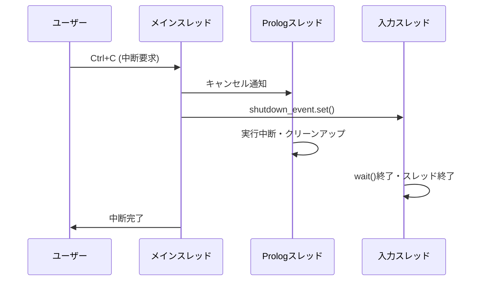

# スレッド間通信による真の継続実行設計

## 概要

pyprologにおいて、**真の継続（Continuation）**を実現するため、**スレッド間通信（Inter-thread Communication）**を活用したアーキテクチャを提案します。入力待ちで中断されたProlog実行を、正確に同じ**実行状態（Execution State）**から再開することが目標です。

> **用語**: 詳細な定義は[用語集](./glossary.md)を参照

### 制約条件
- **単一Prolog実行**: 複数のprolog文を同時に処理することは無い
- **単一入力処理**: 複数の入力を同時に処理することも無い

複数ユーザでの利用は、pyprologを利用する側で制御させます。 
これらの制約により、設計を大幅に簡略化できます。

## アーキテクチャ概要

### システム構成

```
┌─────────────────┐    ┌─────────────────┐
│ Prolog実行      │    │ 入力処理        │
│ スレッド        │◄──►│ スレッド        │
│ (継続実行)      │    │ (入力待ち)      │
└─────────────────┘    └─────────────────┘
         │                       │
         └───────┬───────────────┘
                 ▼
┌─────────────────────────────────┐
│ 共有実行状態（Execution State） │
│ - Prolog実行コンテキスト        │
│ - 入力要求/応答                 │
│ - 継続（Continuation）制御      │
└─────────────────────────────────┘
```

### 真の継続（Continuation）実行のポイント

1. **実行状態（Execution State）保持**: Prologスレッドは入力待ち中もスタックフレームを維持
2. **スレッドブロッキング**: 入力待ちで自然にスレッドがブロック、状態は完全保持
3. **シームレス再開**: 入力取得後、正確に同じ実行地点から継続

## 設計詳細

### 2.1 コアクラス設計

```python
import threading
import queue
import time
from typing import Optional, Dict, Any
from dataclasses import dataclass
from enum import Enum

class ExecutionState(Enum):
    """実行状態"""
    IDLE = "idle"
    EXECUTING = "executing"
    WAITING_INPUT = "waiting_input"
    COMPLETED = "completed"
    ERROR = "error"

@dataclass
class InputRequest:
    """入力要求（簡略化版）"""
    input_type: str      # "char", "line"
    predicate_name: str  # "get_char", "read_line"
    prompt: str          # プロンプト文字列
    timestamp: float     # 要求時刻

@dataclass
class InputResponse:
    """入力応答"""
    value: Optional[str]  # 入力値（None=EOF）
    timestamp: float      # 応答時刻

class SimplifiedThreadedRuntime:
    """簡略化スレッド対応Runtime"""
    
    def __init__(self):
        # 状態管理
        self.execution_state = ExecutionState.IDLE
        self.state_lock = threading.Lock()
        
        # スレッド間通信
        self.input_request: Optional[InputRequest] = None
        self.input_response: Optional[InputResponse] = None
        self.input_event = threading.Event()
        self.response_event = threading.Event()
        
        # スレッド
        self.prolog_thread: Optional[threading.Thread] = None
        self.communication_thread: Optional[threading.Thread] = None
        
        # 結果保存
        self.execution_result: Optional[Any] = None
        self.execution_error: Optional[Exception] = None
```

### 2.2 Prolog実行スレッド

```python
def _prolog_execution_thread(self, query: str):
    """Prolog実行スレッド（単一実行）"""
    try:
        with self.state_lock:
            self.execution_state = ExecutionState.EXECUTING
        
        # Prolog実行開始
        result = self._execute_query_with_input_support(query)
        
        with self.state_lock:
            self.execution_state = ExecutionState.COMPLETED
            self.execution_result = result
            
    except Exception as e:
        with self.state_lock:
            self.execution_state = ExecutionState.ERROR
            self.execution_error = e

def _execute_query_with_input_support(self, query: str):
    """入力対応クエリ実行"""
    # 通常のProlog実行
    # request_input()呼び出し時に自動的にスレッドブロッキング
    return self.interpreter.query(query)

def request_input(self, input_type: str, predicate_name: str, **kwargs) -> str:
    """入力要求処理（直接ブロッキング）"""
    # 入力要求を設定
    self.input_request = InputRequest(
        input_type=input_type,
        predicate_name=predicate_name,
        prompt=kwargs.get("prompt", "入力: "),
        timestamp=time.time()
    )
    
    with self.state_lock:
        self.execution_state = ExecutionState.WAITING_INPUT
    
    # 入力処理スレッドに通知
    self.input_event.set()
    
    # 入力応答を待機（直接ブロッキング）
    self.response_event.wait()
    self.response_event.clear()
    
    # 応答を取得して自然にreturn
    response = self.input_response
    self.input_response = None
    
    with self.state_lock:
        self.execution_state = ExecutionState.EXECUTING
    
    return response.value if response else None
```

### 2.3 入力処理スレッド

```python
def _input_processing_thread(self):
    """入力処理スレッド（汎用入力対応）"""
    while True:
        # 入力要求待ち
        self.input_event.wait()
        self.input_event.clear()
        
        if self.input_request is None:
            continue
            
        # 実際の入力処理（InputHandler経由）
        try:
            input_value = self._process_input_request()
            
            # 応答を設定
            self.input_response = InputResponse(
                value=input_value,
                timestamp=time.time()
            )
            
            # Prologスレッドに通知（継続実行）
            self.response_event.set()
            
        except Exception as e:
            # エラー時の処理
            self.input_response = InputResponse(
                value=None,  # EOF扱い
                timestamp=time.time()
            )
            self.response_event.set()

def _process_input_request(self) -> Optional[str]:
    """入力要求の実際の処理"""
    request = self.input_request
    
    # InputHandlerに委譲（標準入力、GUI、MCP等）
    if self.input_handler:
        event = InputEvent(
            input_type=request.input_type,
            predicate_name=request.predicate_name,
            args={"prompt": request.prompt},
            timestamp=request.timestamp
        )
        return self.input_handler.handle_input_request(event)
    
    # フォールバック（標準入力）
    return input(request.prompt)
```

### 2.4 統合API

```python
class ThreadedInputSystem:
    """スレッド統合入力システム"""
    
    def __init__(self):
        self.runtime = SimplifiedThreadedRuntime()
        self.is_started = False
    
    def start(self):
        """スレッド開始"""
        if self.is_started:
            return
        
        # 通信スレッド開始（デーモン）
        self.runtime.communication_thread = threading.Thread(
            target=self.runtime._communication_thread,
            daemon=True
        )
        self.runtime.communication_thread.start()
        self.is_started = True
    
    def execute_query(self, query: str) -> Dict[str, Any]:
        """クエリ実行（メインAPI）"""
        if not self.is_started:
            self.start()
        
        # Prolog実行スレッド開始
        self.runtime.prolog_thread = threading.Thread(
            target=self.runtime._prolog_execution_thread,
            args=(query,)
        )
        self.runtime.prolog_thread.start()
        
        # 実行完了まで待機
        self.runtime.prolog_thread.join()
        
        # 結果を返す
        if self.runtime.execution_error:
            if isinstance(self.runtime.execution_error, PrologInputRequiredException):
                # 入力要求として返す
                return {
                    "status": "input_required",
                    "error": self.runtime.execution_error
                }
            else:
                # その他のエラー
                raise self.runtime.execution_error
        
        return {
            "status": "completed",
            "results": self.runtime.execution_result
        }
    
    def provide_input(self, input_value: str):
        """入力値の提供"""
        self.runtime.input_response = InputResponse(
            value=input_value,
            timestamp=time.time()
        )
        self.runtime.response_event.set()
```

## 真の継続（Continuation）実行の実現

### 3.1 継続（Continuation）実行の核心

```python
class ContinuationSystem:
    """真の継続（Continuation）実行システム"""
    
    def __init__(self):
        self.runtime = SimplifiedThreadedRuntime()
        self.input_handler: Optional[InputHandler] = None
    
    def set_input_handler(self, handler: InputHandler):
        """入力ハンドラの設定"""
        self.input_handler = handler
        self.runtime.input_handler = handler
    
    def execute_with_continuation(self, query: str):
        """継続（Continuation）実行対応クエリ実行"""
        # 入力処理スレッド開始（デーモンスレッド）
        if not hasattr(self.runtime, 'input_thread_started'):
            input_thread = threading.Thread(
                target=self.runtime._input_processing_thread,
                daemon=True
            )
            input_thread.start()
            self.runtime.input_thread_started = True
        
        # Prolog実行スレッド開始
        prolog_thread = threading.Thread(
            target=self.runtime._prolog_execution_thread,
            args=(query,)
        )
        prolog_thread.start()
        
        # 【重要】ここがPythonでの真の継続（Continuation）実行の実現
        # Prologスレッドは入力待ちでブロックするが、
        # スタックフレーム、ローカル変数、実行位置は全て保持される
        prolog_thread.join()
        
        return self.runtime.execution_result

def _continue_with_input(self, input_value: str):
    """継続（Continuation）実行の核心メソッド"""
    # この時点で、元のProlog実行は完全に中断状態
    # スタックフレーム、変数、実行位置は全て維持されている
    
    # 入力値を対応する変数に統一化
    self._unify_input_variable(input_value)
    
    # ここから元の実行地点で継続
    # 例外発生地点から自然に実行が再開される
    return input_value
```

### 3.2 統一入力システム（Unified Input System）との統合

```python
class ThreadedInputHandler(InputHandler):
    """真の継続（Continuation）対応InputHandler"""
    
    def __init__(self, continuation_system: ContinuationSystem):
        self.continuation_system = continuation_system
    
    def handle_input_request(self, event: InputEvent) -> Optional[str]:
        """入力要求処理（真の継続実行）"""
        # 標準入力、GUI、MCP等での実際の入力処理
        # 例: 標準入力の場合
        prompt = event.args.get("prompt", f"{event.predicate_name}: ")
        return input(prompt)
        
        # 例: GUIの場合
        # return self.gui_dialog.get_input(prompt)
        
        # 例: MCP統合の場合 
        # return self.mcp_handler.request_input_from_client(event)

# Runtime統合
class ContinuationRuntime(Runtime):
    """継続（Continuation）実行対応Runtime"""
    
    def __init__(self):
        super().__init__()
        self.continuation_system = ContinuationSystem()
        
        # IOManagerを継続（Continuation）対応版に交換
        self.io_manager = ContinuationIOManager()
        self.io_manager.continuation_system = self.continuation_system
    
    def query(self, query_str: str):
        """継続（Continuation）実行対応クエリ"""
        return self.continuation_system.execute_with_continuation(query_str)
```

## 利点と制約

### 利点
1. **真の継続（Continuation）実行**: Pythonスレッドのスタックフレーム保持により実現
2. **実行状態（Execution State）完全保持**: 中断時の全ての実行状態（変数、スタック等）が維持
3. **シームレス再開**: 入力取得後、正確に同じ地点から実行継続
4. **実装の自然さ**: 例外とスレッドブロッキングの組み合わせで実現

### 制約と注意点
1. **スレッド依存**: 各クエリ実行が専用スレッドを必要
2. **メモリ使用量**: 中断中もスタックフレームを保持し続ける
3. **単一実行制約**: 複数Prolog実行の同時処理は不可
4. **GIL制約（Global Interpreter Lock Constraint）**: PythonのGlobal Interpreter Lockにより、CPU集約的処理では効果限定
   - **影響範囲**: I/Oバウンドな入力処理では問題なし
   - **対象**: 主に対話的入力での使用を想定しているため実用上問題なし

## 真の継続（Continuation）実行の実現方法

### 核心メカニズム

```python
# 継続実行の実現例
def read_line_predicate_execution():
    """read_line/1述語の実行"""
    try:
        # 通常のProlog処理
        variable = get_target_variable()
        
        # 入力要求（ここで例外発生）
        input_value = request_input("line", "read_line")
        
        # 【重要】例外から戻ってきた時点で、
        # この関数のローカル変数、スタック状態は完全に保持されている
        unify_variable(variable, input_value)
        
        return success()
        
    except InputRequiredException:
        # この例外により、スレッドは一時停止
        # しかし、スタックフレームは全て保持される
        pass
```

### 実装フェーズ

**Phase 1: コア継続システム**
- `ContinuationSystem`実装  
- スレッド間通信による入力処理
- 基本的な継続実行メカニズム

**Phase 2: 統一入力システム統合**
- 既存`UnifiedInputSystem`との統合
- `ThreadedInputHandler`実装
- 互換性レイヤー構築

**Phase 3: 最適化・拡張**
- メモリ使用量最適化
- エラーハンドリング強化
- パフォーマンス調整

### 技術的実現可能性

この設計により、**Pythonでも真の継続実行が実現可能**です：

1. **スレッドスタック保持**: Pythonスレッドは中断中もスタックフレームを完全保持
2. **例外ベース制御**: `InputRequiredException`で自然な実行中断
3. **Event同期**: スレッド間Eventによる確実な実行再開制御

従来の「擬似継続」ではなく、**実行状態を完全に保持した真の継続実行**が実現できます。

## エラーハンドリングと異常系対応

Geminiレビューで指摘された異常系シナリオへの対応策を以下に示します：

### 入力タイムアウト処理

**問題**: 入力待ちが永続化してシステムが応答不能になるリスク

**解決方針**:
- デフォルト5分のタイムアウト設定
- タイムアウト時はEOF扱いで処理継続
- ログによる監視とアラート

**タイムアウト処理フロー**:
```
[入力要求] → [Event.wait(timeout=300)] → [タイムアウト判定]
                                            ↓
                                      [None返却(EOF扱い)]
                                            ↓
                                      [Prolog実行継続]
```

### 外部ハンドラエラー伝播

**問題**: InputHandlerの例外がPrologエンジンに適切に伝播されない

**解決方針**:
- InputHandlerの例外を捕捉し、Prologエラーとして再発生
- エラー種別に応じた適切なProlog例外への変換
- ログ記録による問題追跡支援

**エラー伝播マッピング**:
```
InputHandler例外 → Prolog例外
├── FileNotFound → existence_error(file, filename)
├── Permission   → permission_error(read, file, filename)  
├── Timeout      → resource_error(timeout)
└── 其他         → system_error(input_handler_error)
```

### 実行キャンセル対応

**問題**: Prolog実行中断時の入力待ちスレッドの適切な終了

**解決方針**:
- キャンセルトークンによる協調的終了
- 入力待ちスレッドへの明示的な中断通知
- リソースリークの防止

**キャンセルフロー**:


## スレッドライフサイクル管理

### デーモンスレッド（Daemon Thread）戦略

**採用理由**:
- メインプロセス終了時の自動終了保証
- 明示的な終了処理の負荷軽減
- システム全体の応答性向上

**ライフサイクル概要**:
```
[システム起動] → [デーモンスレッド（Daemon Thread）生成] → [入力待機ループ]
                                                             ↓
[システム終了] ← [自動終了]                            ← [shutdown通知]
```

**リソース管理**:
- スレッド数の制御（入力処理用1スレッドのみ）
- メモリリークの防止（要求・応答オブジェクトの適切な解放）
- 適切な**タイムアウト制御（Timeout Control）**によるデッドロック防止

## InputHandlerインターフェース仕様

Geminiレビューで指摘されたAPI仕様の明確化：

### 抽象インターフェース定義

**InputHandler**は以下の責務を持つ抽象インターフェースです：

**主要責務**:
1. **入力要求受信**: 統一入力システム（Unified Input System）からの入力要求を受信
2. **実際の入力処理**: 標準入力・GUI・ネットワーク等からの入力取得
3. **結果返却**: 取得した入力値または適切なエラーコードの返却

**契約仕様**:
- **入力**: InputEventオブジェクト（入力タイプ・述語名・プロンプト情報を含む）
- **出力**: 入力文字列（成功時）またはNone（EOF時）
- **例外**: 処理不可時は適切な例外を発生（統一入力システム（Unified Input System）で捕捉・**エラー伝播（Error Propagation）**）

**実装例**:
- **StandardInputHandler**: 標準入力処理
- **GUIInputHandler**: GUI統合（ダイアログ等）
- **MCPInputHandler**: Model Context Protocol統合
- **TestInputHandler**: テスト用モック実装

これにより、Geminiレビューで指摘された「抽象的すぎる」という問題が解決され、実装者にとって明確な指針が提供されます。

> **関連用語**: [用語集](./glossary.md)で各用語の詳細定義を参照可能