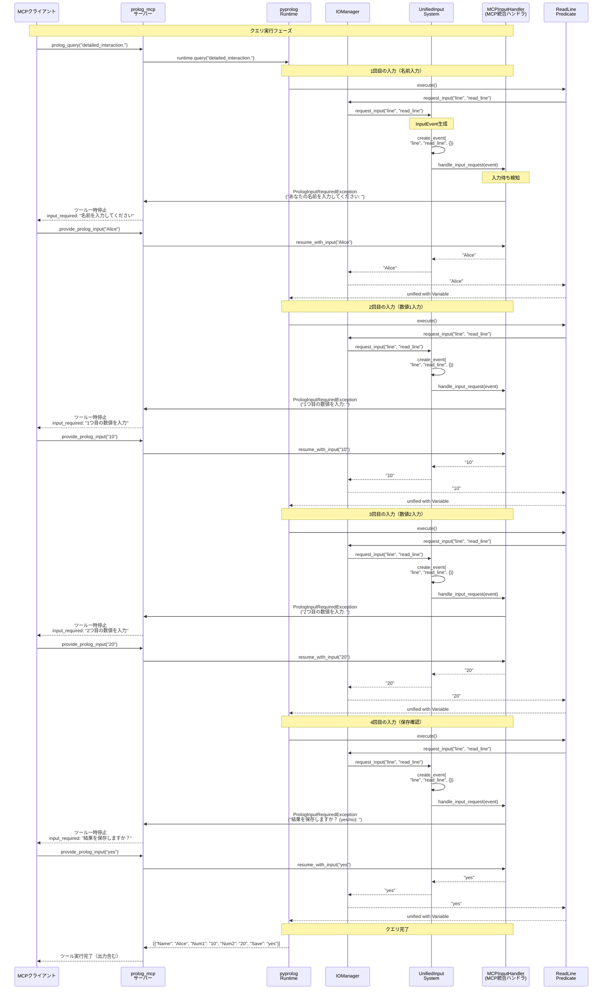

# MCP統合シーケンス図

## 概要

改修後のpyprologを使用してprolog_mcpで`addition_calculator.pl`の`detailed_interaction`述語を実行する際の、統一入力システムの動作フローを示します。

## シーケンス図



## 詳細な動作説明

### クエリ実行フェーズ

**MCP統合での入力処理フロー:**
1. `detailed_interaction`述語が実行される
2. 各`read_line/1`呼び出しで以下が発生：
   - ReadLinePredicateがIOManagerに入力要求
   - IOManagerがUnifiedInputSystemに転送
   - InputEventが生成される（入力タイプ、述語名、タイムスタンプ等）
   - MCPInputHandlerが入力待ちを検知し、`PrologInputRequiredException`を発生
   - prolog_mcpサーバーが例外をキャッチし、MCPクライアントに入力要求を通知
   - MCPクライアントがユーザーから入力を取得し、`provide_prolog_input`で返送
   - ハンドラが入力値を受け取り、統一入力システム経由でProlog実行を再開

**MCP統合の重要な特徴:**
- **非同期的な対話**: 入力待ちで実行が一時停止し、クライアントからの入力で再開
- **例外ベースの制御**: `PrologInputRequiredException`で入力待ち状態を表現
- **MCPツール分離**: `provide_prolog_input`専用ツールで入力値を供給
- **統一的な処理**: 全ての入力タイプ（char、line等）が同一メカニズムで処理

## MCP統合ハンドラ実装例

```python
class MCPInputHandler(InputHandler):
    """MCP統合用の入力ハンドラ"""
    
    def __init__(self):
        self.pending_input = None
        self.input_event = threading.Event()
    
    def handle_input_request(self, event: InputEvent) -> Optional[str]:
        """入力要求を検知してMCPクライアントに通知"""
        # プロンプトメッセージの抽出（Prologの出力から）
        prompt = self._extract_prompt_from_context(event)
        
        # prolog_mcpサーバーに入力要求例外を発生
        raise PrologInputRequiredException(
            input_type=event.input_type,
            predicate_name=event.predicate_name, 
            prompt=prompt,
            event_id=event.request_id
        )
    
    def resume_with_input(self, input_value: str) -> str:
        """MCPクライアントから入力値を受け取って再開"""
        self.pending_input = input_value
        self.input_event.set()
        return input_value
    
    def _extract_prompt_from_context(self, event: InputEvent) -> str:
        """実行コンテキストからプロンプト文字列を抽出"""
        # Prologの出力バッファからプロンプトを取得
        # または event.context から取得
        return event.get_arg("prompt", "入力してください: ")

# prolog_mcpサーバーでの使用
class PrologInputRequiredException(Exception):
    """入力要求例外 - MCPクライアントに通知するため"""
    def __init__(self, input_type: str, predicate_name: str, prompt: str, event_id: str):
        self.input_type = input_type
        self.predicate_name = predicate_name
        self.prompt = prompt
        self.event_id = event_id
        super().__init__(f"Input required: {prompt}")

# MCP サーバー側での処理
try:
    results = runtime.query("detailed_interaction.")
except PrologInputRequiredException as e:
    # MCPクライアントに入力要求を通知
    return {
        "status": "input_required",
        "input_type": e.input_type,
        "prompt": e.prompt,
        "event_id": e.event_id
    }
```

## MCP統合の利点

この統一入力システム + MCP統合により：

1. **真の対話的実行**: MCPクライアント（Claude Desktop等）でユーザーが実際に入力
2. **統一的な制御**: 全ての入力述語が同一の仕組みで処理
3. **拡張性**: 新しい入力タイプも自動的にMCP対応
4. **デバッグ支援**: 入力要求の履歴・統計情報が統一管理